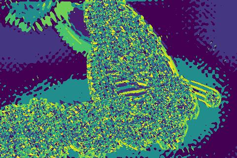
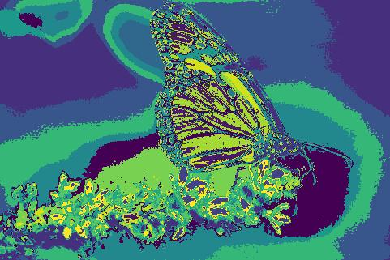
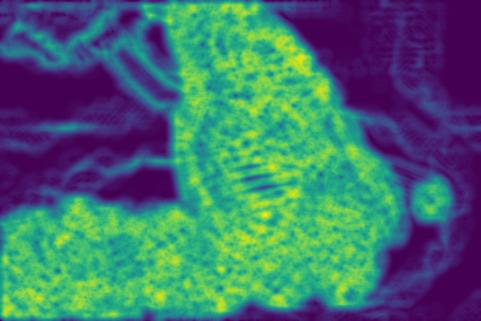
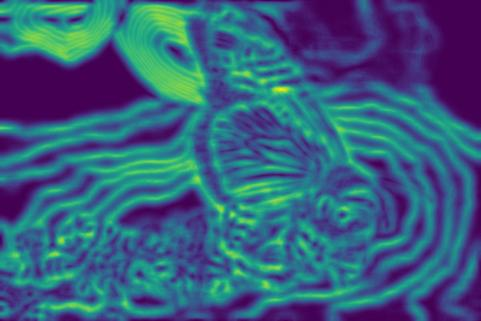
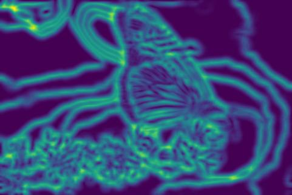
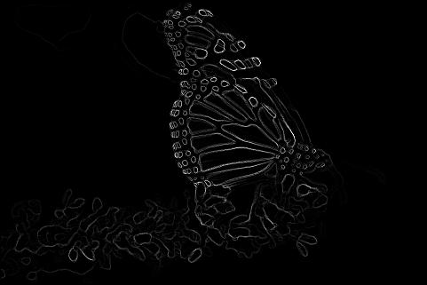

# Probabilistic Boundary Detection and Improving Convolutional Networks

### *RBE549: Computer Vision - [Worcester Polytechnic Institute](https://www.wpi.edu/), Spring 2024*

## Project Guidelines:
The project is divided into two phases. The first phase is to implement a probabilistic boundary detection algorithm. The second phase is to implement and improve the performance of the convolutional backbones using different techniques.
Details of the project can be found [here](https://rbe549.github.io/spring2024/hw/hw0/).

## Phase 1: Shake My boundary

### Overview:
Phase 1 of the project involves the creation of various filter banks and their application to images for texture, brightness, and color analysis. The primary goal is to generate different maps and gradients that will be used to create a probabilistic boundary detection algorithm.

#### Steps to run the code:

To run the PBLite boundary detection, use the following command:

```bash
python Wrapper.py
```
Wrappery.py reads input images from "BSDS500" folder and all the ouptuts are stored in the "Outputs" folder.

#### Input:
Original Image:
<p align="left">
  

#### Outputs:

Following are the outputs generated by the code:

Image Maps:
<p align="center">
  <table>
    <tr>
      <td>  </td>
      <td>  </td>
      <td>  </td>
    </tr>
    <tr>
      <td align="center">Texton Map</td>
      <td align="center">Brightness Map</td>
      <td align="center">Color Map</td>
    </tr>
  </table>
</p>

Image Gradients:
<p align="center">
  <table>
    <tr>
      <td>  </td>
      <td>  </td>
      <td>  </td>
    </tr>
    <tr>
      <td align="center">Texton Gradient</td>
      <td align="center">Brightness Gradient</td>
      <td align="center">Color Gradient</td>
    </tr>
  </table>
</p>

Boundary Detection:
<p align="center">
  <table>
    <tr>
      <td>  </td>
      <td>  </td>
      <td>  </td>
    </tr>
    <tr>
      <td align="center">Canny Baseline</td>
      <td align="center">Sobel Baseline</td>
      <td align="center">PBLite</td>
    </tr>
  </table>
</p>


## Phase 2: Deep Dive on Deep Learning

### Overview:
Phase 2 of the project involves the implementation of different convolutional backbones and their performance comparison. The primary goal is to implement and improve the performance of the convolutional backbones.

### Steps to run the code:

Train the model

```bash
python Train.py --NumEpochs <NUMBER_OF_EPOCHS> --MiniBatchSize <BATCH_SIZE> --ModelType <MODEL_TYPE> --CustomLogs <PATH_TO_CUSTOMLOGS>

usage: Train.py [-h] [--CheckPointPath CHECKPOINTPATH] [--NumEpochs NUMEPOCHS] [--DivTrain DIVTRAIN] [--MiniBatchSize MINIBATCHSIZE] [--LoadCheckPoint LOADCHECKPOINT] [--LogsPath LOGSPATH] [--ModelType MODELTYPE] [--CustomLogs CUSTOMLOGS]

optional arguments:
  -h, --help            show this help message and exit
  --CheckPointPath CHECKPOINTPATH
                        Path to save Checkpoints, Default: ../Checkpoints/
  --NumEpochs NUMEPOCHS
                        Number of Epochs to Train for, Default:50
  --DivTrain DIVTRAIN   Factor to reduce Train data by per epoch, Default:1
  --MiniBatchSize MINIBATCHSIZE
                        Size of the MiniBatch to use, Default:1
  --LoadCheckPoint LOADCHECKPOINT
                        Load Model from latest Checkpoint from CheckPointsPath?, Default:0
  --LogsPath LOGSPATH   Path to save Logs for Tensorboard, Default=Logs/
  --ModelType MODELTYPE
                        Model to use for training Model Types are Baseline, BatchNorm, ResNet, ResNeXt, DenseNet, Default:Baseline
  --CustomLogs CUSTOMLOGS
                        Path to save Logs and dynamic plots, Default=../Logs
```

Example:
```bash
python Train.py --NumEpochs 50 --MiniBatchSize 32 --ModelType Baseline --CustomLogs ../Logs
```

Test the model

```bash
python Test.py --ModelPath <PATH_TO_CHECKPOINT> --SelectTestSet False --ModelType Baseline

usage: Test.py [-h] [--ModelPath MODELPATH] [--LabelsPath LABELSPATH] [--SelectTestSet SELECTTESTSET] [--ModelType MODELTYPE] [--ConfusionMatrixPath CONFUSIONMATRIXPATH]

optional arguments:
  -h, --help            show this help message and exit
  --ModelPath MODELPATH
                        Path to load latest model from, Default:ModelPath
  --LabelsPath LABELSPATH
                        Path of labels file, Default:./TxtFiles/LabelsTest.txt
  --SelectTestSet SELECTTESTSET
                        Choose the set to run the test on, Default:True
  --ModelType MODELTYPE
                        Model to use for training Model Types are Baseline, BatchNorm, ResNet, ResNeXt, DenseNet, Default:Baseline
  --ConfusionMatrixPath CONFUSIONMATRIXPATH
                        Path to save the confusion matrix Default:./Logs
```

Example:
```bash
python Test.py --ModelPath ../Checkpoints/Baseline/ --ModelType Baseline
```
