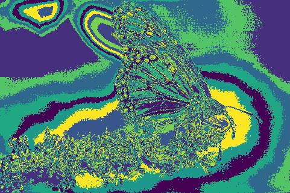

# Probabilistic Boundary Detection and Improving Convolutional Backbones

### *RBE549: Deep Learning - [Worcester Polytechnic Institute](https://www.wpi.edu/), Spring 2024*

## Project Guidelines:
The project is divided into two phases. The first phase is to implement a probabilistic boundary detection algorithm. The second phase is to improve the performance of the convolutional backbones using different techniques.
Details of the project can be found [here](https://rbe549.github.io/spring2024/hw/hw0/).

## Phase 1: Shake My boundary

### Overview:
Phase 1 of the Alohomora project involves the creation of various filter banks and their application to images for texture, brightness, and color analysis. The primary goal is to generate different maps and gradients that will be used to create a probabilistic boundary detection algorithm.

#### Steps to run the code:

To run the PBLite boundary detection, use the following command:

```bash
python Wrapper.py
```
Wrappery.py reads input images from "BSDS500" folder and all the ouptuts are stored in the "Outputs" folder.

#### Input:
Original Image:
<p align="left">
  

#### Outputs:

Following are the outputs generated by the code:

Image Maps:
<p align="center">
  <table>
    <tr>
      <td>  </td>
      <td>  </td>
      <td>  </td>
    </tr>
    <tr>
      <td align="center">Texton Map</td>
      <td align="center">Brightness Map</td>
      <td align="center">Color Map</td>
    </tr>
  </table>
</p>

Image Gradients:
<p align="center">
  <table>
    <tr>
      <td>  </td>
      <td>  </td>
      <td>  </td>
    </tr>
    <tr>
      <td align="center">Texton Gradient</td>
      <td align="center">Brightness Gradient</td>
      <td align="center">Color Gradient</td>
    </tr>
  </table>
</p>

Boundary Detection:
<p align="center">
  <table>
    <tr>
      <td>  </td>
      <td>  </td>
      <td>  </td>
    </tr>
    <tr>
      <td align="center">Canny Baseline</td>
      <td align="center">Sobel Baseline</td>
      <td align="center">PBLite</td>
    </tr>
  </table>
</p>


## Phase 2: Deep Dive on Deep Learning

### Steps to run the code:

Train the model

```bash
python Train.py --NumEpochs 40 --MiniBatchSize 256 --ModelType Baseline --CustomLogs PATH_TO_CUSTOMLOGS
```
There are 5 model types: 'Baseline', 'BatchNorm', 'ResNet', 'ResNeXt', 'DenseNet'. This argument selects the model type for training.

--CustomLogs provides path to store model performance plots and best checkpoints dynamically during training.

Test the model

```bash
python Test.py --ModelPath PATH_TO_CHECKPOINT --SelectTestSet False --ModelType Baseline
```
--SelectTestSet selects the dataset on which the test operation is to be performed i.e. either TrainSet or TestSet. Default is TestSet.
